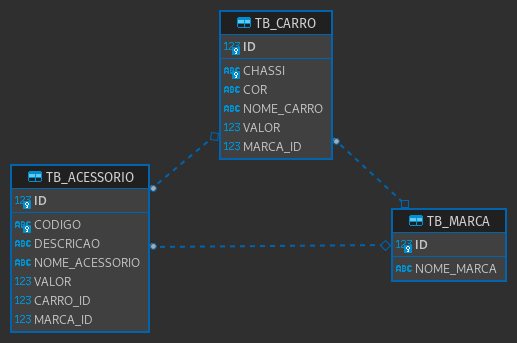

# concessionariaTOP
Um projeto java simples utilizando JPA com JPQL e persistindo no Derby DB.

### Dependências

- Eclipse Link e Eclipse Persistence (Implementação da JPA)

```xml
<dependency>
	<groupId>org.eclipse.persistence</groupId>
	<artifactId>eclipselink</artifactId>
	<version>2.2.1</version>
</dependency>
<dependency>
	<groupId>org.eclipse.persistence</groupId>
	<artifactId>javax.persistence</artifactId>
	<version>2.0.3</version>
</dependency>  
```

- Banco de dados Apache Derby DB (Persistência local)

```xml
<dependency>
	<groupId>org.apache.derby</groupId>
	<artifactId>derby</artifactId>
	<version>10.8.2.2</version>
</dependency>
<dependency>
	<groupId>org.apache.derby</groupId>
	<artifactId>derbytools</artifactId>
	<version>10.8.2.2</version>
</dependency>
```

### Diagrama Entidade-Relacionamento



- Uma marca possui vários carros e acessórios;
- Um acessório possui um carro e uma marca;
- Um Carro possui uma marca e vários acessórios.
